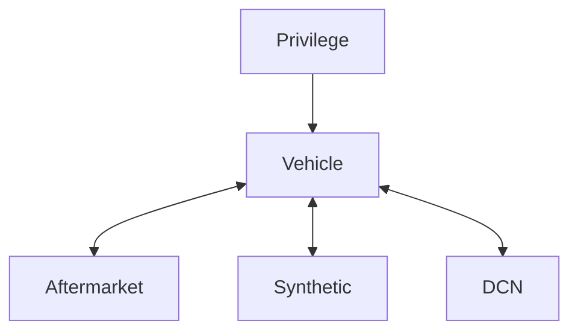

# identity-api

Run `make help` to see some helpful sub-commands:

## If you're using MacOS, install latest make

`brew install make`

`make` will now be called `gmake`

```
% make help

Specify a subcommand:

  lint                 Run linter.
  test                 Run all package tests.
  clean                Remove previous builds.
  run                  Run the app.
  migrate              Run database migrations.
  sql                  Create a new SQL migration file. Use the NAME variable to set the name: "make sql NAME=dcn_table".
  boil                 Generate SQLBoiler models.
  gql                  Generate gqlgen code.
  tools-golangci-lint  Install golangci-lint dependency.
  tools-gqlgen         Install gqlgen dependency.
  tools-goose          Install goose dependency.
  tools-sqlboiler      Install sqlboiler dependency.
  tools                Install all tool dependencies.
```



- Vehicles
  - Selection
    - To which vehicles do I have access? Either because I own them or because they are shared with me.
  - Which (non-expired) privileges have been granted on these?
- Aftermarket devices
  - Selection
    - Which devices do I own?
  - Is it paired? To which vehicle?

## Migrations

Add a migrations:
`make tools-goose` Installs the correct version of goose.
`make sql NAME=dcn_table` creates a new migration file.

## Generate GraphQL

`make tools-gqlgen` Installs the correct version of gqlgen.
`make gql` Regenerates the gqlgen code.

## Generate SQLBoiler

`docker-compose up -d db` Starts a Postgres database.
`make tools-boil` Installs the correct version of sqlboiler.
`make migrate` Runs unapplied database migrations.
`make boil` Regenerates the SQLBoiler models.

## License

[Apache 2.0](LICENSE)
