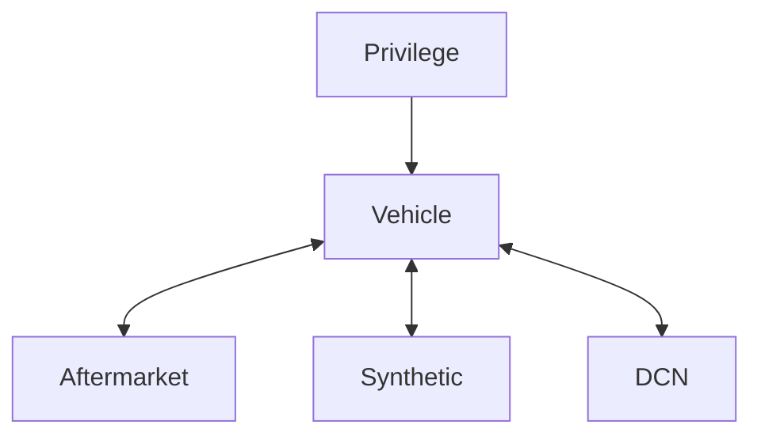

# identity-api

Run `make` to see some helpful sub-commands:

```
% make

Specify a subcommand:

  run                  Run the app.
  migrate              Run unapplied database migrations.
  sql                  Create a new SQL migration file. Use the NAME variable to set the name: "make sql NAME=dcn_table".
  boil                 Regenerate SQLBoiler models.
  gql                  Regenerate gqlgen code.
  lint                 Run golangci-lint linters.
```



- Vehicles
  - Selection
    - To which vehicles do I have access? Either because I own them or because they are shared with me.
  - Which (non-expired) privileges have been granted on these?
- Aftermarket devices
  - Selection
    - Which devices do I own?
  - Is it paired? To which vehicle?

## Migrations

Add a migrations:
`$ goose -dir migrations create <migration_name> sql`

## License

[Apache 2.0](LICENSE)
