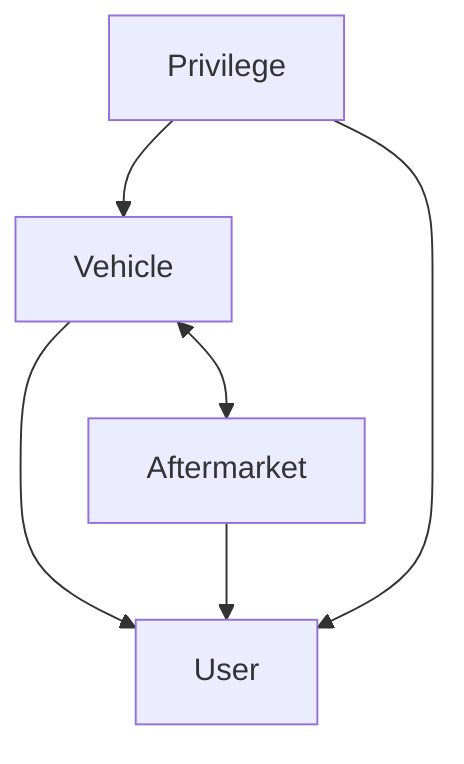

# identity-api

Run `make` to see some helpful sub-commands:

```
% make

Specify a subcommand:

  run                  Run the app.
  migrate              Run database migrations.
  boil                 Generate SQLBoiler models.
  gql                  Generate gqlgen code.

```

## Start App

`go run ./cmd/identity-api`

## Create migration

`goose -dir migrations create <migration_name> sql`

## graphQL generate new schema model

```bash
go generate ./...
```



* Vehicles
  * Selection
    * To which vehicles do I have access? Either because I own them or because they are shared with me.
  * Which (non-expired) privileges have been granted on these?
* Aftermarket devices
  * Selection
    * Which devices do I own?
  * Is it paired? To which vehicle?
